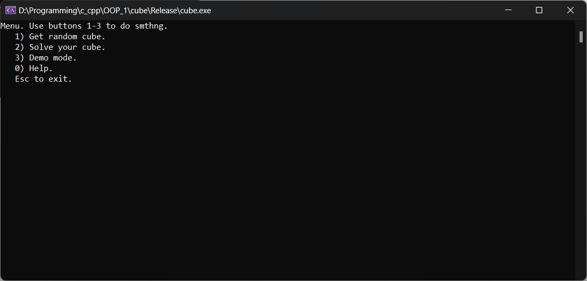

# Rubik's cube
Project for the first part of OOP course.

Simple rubik's cube implementation with console graphics.
You can:
- get a random destroying algorithm for your cube
- solve your cube
- play with an interractive mode in which you can get random sequence for cube destruction and immediately redraw it.

In solution mode you can enter your cube using console/file or interractive mode. There is an "in.txt" file with pattern of destroyed cube for test.

So, the solution mode is represented here:

Interactive entering mode:

Destroying mode:

Menu and help list:

